class: middle, center, title-slide
count: false

# Likelihood-free inference, effectively.

With its applications at the LHC.

  

Prof. Gilles Louppe 
[g.louppe@uliege.be](mailto:g.louppe@uliege.be)

---

class: middle

.center.width-70[]

.footnote[Refs:
[GaltonBoard.com](http://galtonboard.com)
]

---

class: middle

.grid[
.kol-2-3[

    

Sir Francis Galton saw the quincunx as an analogy for the inheritance of genetic traits like stature.
The pinballs accumulate in a bell-shaped curve that is similar to the distribution of human heights.

The puzzle of why human heights do not spread out from one generation to the next, as the balls would, led him to the discovery of "regression to the mean".

]
.kol-1-3.center[
.circle.width-100[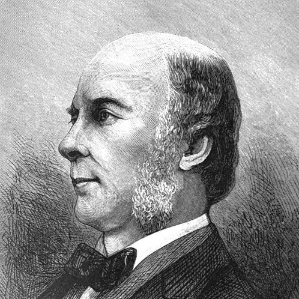]

.width-100[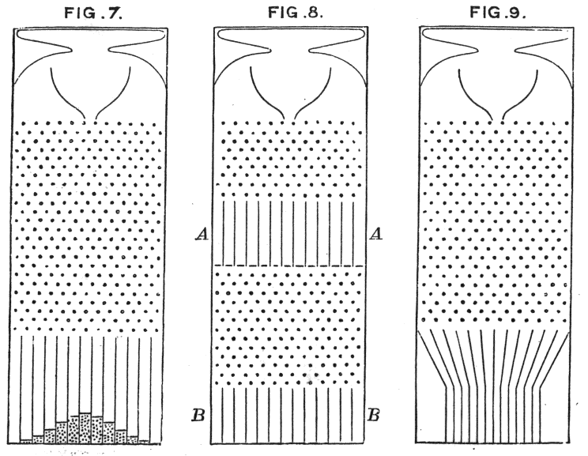]
]
]

---

class: middle

.center.width-70[]

The probability of ending in bin $x$ corresponds to the cumulative probability of all the paths $z$ from start to $x$.

$$p(x) = \int\_{\mathcal{Z}} p(x,z) dP\_{\mathcal{Z}}$$

---

class: middle

Assume pins all have the same effect on the balls.

Each time a ball hits a pin on its way down, it either bounces right with probability $\theta$ or left with probability $1-\theta$.

Therefore, at the last row $n$, each ball arrives in bin $x$ (for $0 \leq k \leq n$) if and only if it has taken exactly $x$ right turns (regardless of their position). This occurs with probability
$$\begin{aligned}
p(x | \theta)
&= \int\_{\mathcal{Z}} p(x,z|\theta) dP\_{\mathcal{Z}} \\\\
&= \begin{pmatrix}
n \\\\
x
\end{pmatrix}
\theta^x (1-\theta)^{n-x}.
\end{aligned}$$

That is, the ball distribution over the bins corresponds to a **binomial distribution**.

---

# Inference

Given a set of realizations $\mathbf{d} = \\\{ x\_i \\\}$ at the bins, **inference** consists in determining the value of $\theta$ that best describes these observations.

For example, following the principle of maximum likelihood estimation, we have
$$\hat{\theta} = \arg \max\_\theta \prod_{x\_i \in \mathbf{d}} p(x\_i | \theta).$$

In general, when $p(x\_i | \theta)$ can be evaluated, this problem can be solved either analytically or using  optimization algorithms.

---

class: middle

What if pins  are placed asymmetrically, such that the probability of bouncing right at $(i,j)$ is different from the probability at $(i',j')$, but still indirectly depends on some parameters $\theta$?

.center.width-60[]

---

class: middle

The probability of ending in bin $x$ still corresponds to the cumulative probability of all the paths from start to $x$:
$$p(x|\theta) = \int\_{\mathcal{Z}} p(x,z|\theta) dP\_{\mathcal{Z}}$$

- But this integral can no longer be simplified analytically!
- As $n$ grows larger, evaluating $p(x\|\theta)$ becomes **intractable** since the number of paths grows combinatorially.
- Generating observations remains easy: drop the balls.

Since $p(x|\theta)$ cannot be evaluated, does this mean inference is no longer possible?

No! But we do need new tools.

---

class: middle

The Galton board is a metaphore for the simulator-based scientific method:
- the Galton board device is the equivalent of the scientific simulator
- $\theta$ are parameters of interest
- $z$ are stochastic execution traces through the simulator
- $x$ are observables

For the same reasons, inference in this context requires **likelihood-free algorithms**.

---

class: middle

.center.width-100[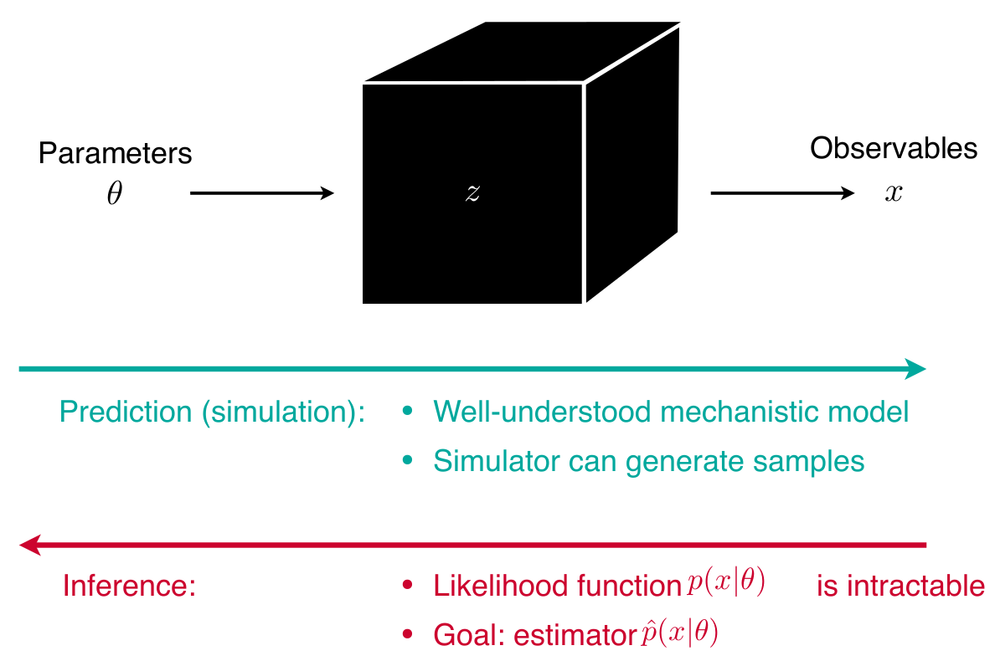]

.footnote[Credits:
Johann Brehmer
]

---

class: middle

# Applications

---

# Cosmological N-body simulations

.center.width-60[]

.grid[
.kol-1-3.width-100[]
.kol-1-3.width-100[]
.kol-1-3.width-100[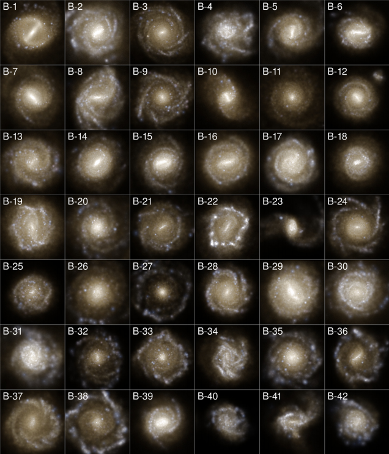]
]

.footnote[Refs:
Planck Collaboration, 2015 ([arXiv:1502.01589](https://arxiv.org/abs/1502.01589));
Vogelsberger et al, 2014 ([arXiv:1405.2921](https://arxiv.org/abs/1405.2921))
]

---

# Computational topography

.center.width-60[]

.grid[
.kol-2-3.width-100[  ]
.kol-1-3.width-100[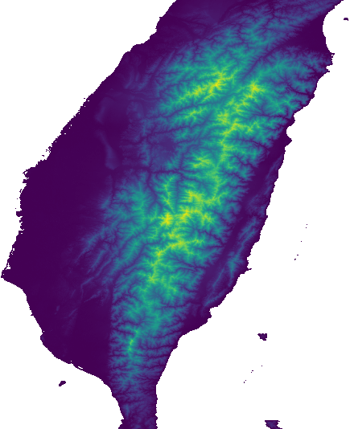]
]

.footnote[Refs:
Benoit Bovy ([xarray-simlab](https://xarray-simlab.readthedocs.io/en/latest/))
]

---

# Climatology

.center.width-60[]

.center.width-80[]

.footnote[Refs:
NASA's Goddard Space Flight Center / B. Putman, 2014 ([press release](https://www.nasa.gov/press/goddard/2014/november/nasa-computer-model-provides-a-new-portrait-of-carbon-dioxide/#.VGpHcS9by7s))
]

---

# Epidemiology

.center.width-60[]

.center.width-90[]

.footnote[Refs:
Brockmann and Helbing, 2013 ([doi:10.1126/science.1245200](http://science.sciencemag.org/content/342/6164/1337))
]

---

# Particle physics

.center.width-60[]

  
.center.width-100[]

.center.italic[The Galton board of particle physics]

---

class: middle

# Likelihood-free inference

---

# The physicist's way

.center.width-90[]

.grid[
.kol-2-3[
Define a projection function $s:\mathcal{X} \to \mathbb{R}$ mapping observables $x$ to a summary statistics $x'=s(x)$.

Then, *approximate* the likelihood $p(x|\theta)$ as
$$p(x|\theta) \approx \hat{p}(x|\theta) = p(x'|\theta),$$
where $p(x'|\theta)$ can be estimated by running the simulator for different parameter values $\theta$ and filling histograms.
]
.kol-1-3.width-100[ ]
]

---

# Hypothesis testing

.grid[
.kol-3-4[
We are not only interested in $\hat{\theta}$, we also want to reject all those hypotheses that do not fit the observations with high probability.

According to the Neyman-Pearson lemma, the **likelihood ratio**
$$r(x|\theta\_0,\theta\_1) \equiv \frac{p(x|\theta\_0)}{p(x|\theta\_1)}$$
is the most powerful test statistic to discriminate between a null hypothesis $\theta\_0$ and an alternative $\theta\_1$.
]
.kol-1-4.width-100[ 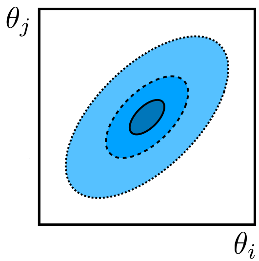]
]
In the likelihood-free setup, the ratio is difficult to compute. However, using the approximate likelihood we can define
$$\frac{p(x|\theta\_0)}{p(x|\theta\_1)} \approx \frac{\hat{p}(x|\theta\_0)}{\hat{p}(x|\theta\_1)}$$

---

class: middle

When testing a null $\theta\_0$ against a set of alternatives $\Theta$ (e.g., background only vs. background + signal), the generalized likelihood ratio is defined as
$$\begin{aligned}
r(x|\theta\_0, \Theta) &= \frac{p(x|\theta\_0)}{\sup\_{\theta \in \Theta} p(x|\theta)} \\\\
&= \frac{p(x|\theta\_0)}{p(x|\hat{\theta})} \\\\
&\approx \frac{\hat{p}(x|\theta\_0)}{\hat{p}(x|\hat{\theta})}
\end{aligned}
$$
where the MLE $\hat{\theta}$ can be approximated by scanning over $\hat{p}(x|\theta)$.

---

class: middle

This methodology has worked great for physicists for the last 20-30 years, but ...

.grid[
.kol-1-2[
- Choosing the projection $s$ is difficult and problem-dependent.
- Often there is no single good variable: compressing to any $x'$ loses information.
- Ideally: analyse high-dimensional $x'$, including all correlations.

Unfortunately, because of the curse of dimensionality, filling high-dimensional histograms is **not tractable**.
]
.kol-1-2.width-100[]
]

Who you gonna call? *Machine learning*!

.footnote[Refs:
Bolognesi et al, 2012 ([arXiv:1208.4018](https://arxiv.org/pdf/1208.4018.pdf))
]

---

class: middle

.center.width-90[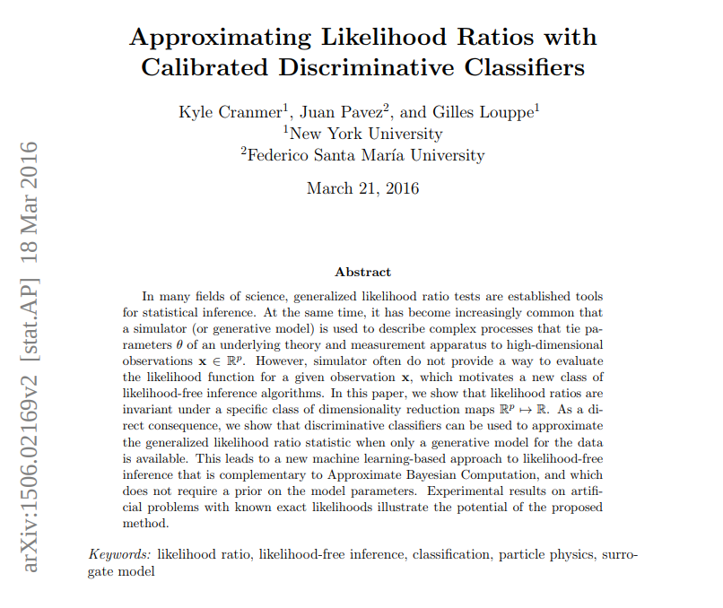]

.footnote[
Refs: Cranmer et al, 2016 ([arXiv:1506.02169](https://arxiv.org/pdf/1506.02169.pdf))
]

---

class: middle

Key insights:

- The likelihood ratio is *sufficient* for maximum likelihood estimation.
- Evaluating the likelihood ratio does **not** require evaluating the individual likelihoods.

---

class: middle

The likelihood ratio is *sufficient* for maximum likelihood estimation:

$$\begin{aligned}
\hat{\theta} &= \arg \max\_\theta  p(\mathbf{d} | \theta) \\\\
 &= \arg \max\_\theta \frac{ p(\mathbf{d} | \theta) }{ \text{constant} } \\\
 &= \arg \max\_\theta \frac{ p(\mathbf{d} | \theta) }{ p(\mathbf{d} | \theta\_\text{ref})} \\\
 &= \arg \max\_\theta \prod\_{x\_i \in \mathbf{d}} \frac{p(x\_i|\theta)}{p(x\_i|\theta\_\text{ref})} \\\\
 &= \arg \max\_\theta \prod\_{x\_i \in \mathbf{d}} r(x\_i|\theta, \theta\_\text{ref})
\end{aligned}$$

---

class: middle

.center.width-40[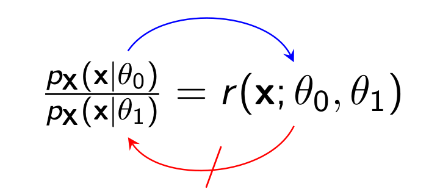]

Evaluating the likelihood ratio does **not** require evaluating the individual likelihoods:

- From $p(x|\theta\_0)$ and $p(x|\theta\_1)$ we can evaluate $r(x|\theta\_0, \theta\_1)$.
- However, from $r(x|\theta\_0, \theta\_1)$ the individual likelihoods $p(x|\theta\_0)$ and $p(x|\theta\_1)$ cannot be reconstructed.

Therefore, MLE inference and likelihood ratio estimation are strictly simpler problems than density estimation.

---

# Cᴀʀʟ

.bold[Theorem.] The likelihood ratio is invariant under the change of variable $U=s(X)$, provided $s(x)$ is monotonic with $r(x)$.

$$r(x|\theta\_0,\theta\_1) = \frac{p(x|\theta\_0)}{p(x|\theta\_1)} = \frac{p(s(x)|\theta\_0)}{p(s(x)|\theta\_1)}$$

- Note that the equality is strict.
- No information relevant for determining the ratio is lost.
- Although information about $x$ may be lost through $s$.

---

class: middle

Supervised learning provides a way to *automatically* construct $s$:
- A binary classifier $\hat{s}$ (e.g., a neural network) trained to distinguish $x \sim p(x|\theta\_0)$  from $x \sim p(x|\theta\_1)$ approximates the optimal classifier
$$s^\*(x) = \frac{p(x|\theta\_1)}{p(x|\theta\_0)+p(x|\theta\_1)},$$
which is monotonic with $r$.
- Therefore, when $\hat{s}=s^\*$, $$r(x|\theta\_0,\theta\_1)=\frac{1-\hat{s}(x)}{\hat{s}(x)}$$

That is, **supervised classification is equivalent to likelihood ratio estimation** and can therefore be used for MLE inference.

---

class: middle

In practice, $\hat{s} \neq s^\*$ because of approximation, estimation or optimization errors.

- Still, the result states that calibrating $\hat{s}(x)$ to build $p(\hat{s}(x)|\theta)$ is sufficient for recovering the true likelihood ratio $r(x|\theta\_0,\theta\_1)$, provided $\hat{s}(x)$ is monotonic with $r(x|\theta\_0,\theta\_1)$.
- This step can be carried with 1D density estimation or calibration algorithms (histograms, KDE, isotonic regression, etc).
- If not monotonic with $r$, then the resulting statistic is strictly less powerful than the true ratio.

---

# Procedure

For inference, we have
$$\begin{aligned}
\hat{\theta} &= \arg \max\_\theta \prod\_{x\_i \in \mathbf{d}} r(x\_i|\theta, \theta\_\text{ref}) \\\\
&=  \arg \max\_\theta \prod\_{x\_i \in \mathbf{d}} \frac{p(\hat{s}(x|\theta,\theta\_\text{ref})|\theta)}{p(\hat{s}(x|\theta,\theta\_\text{ref})|\theta\_\text{ref})}
\end{aligned}$$
where $\hat{s}(x|\theta,\theta\_\text{ref})$ denotes a classifier trained to distinguish between $\theta$ and $\theta\_\text{ref}$.

.grid[
.kol-3-4[

- Point by point optimization: Keep $\theta\_\text{ref}$ fixed, scan for $\theta$, train a new classifier $\hat{s}$ for each $\theta$ and evaluate the ratio.
- Parameterized classifier: Train a single classifier $\hat{s}$ taking both $x$ and $\theta$ as inputs, scan for $\theta$ and evaluate the ratio.

]
.kol-1-4.width-100[   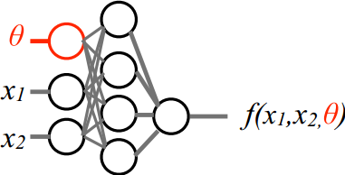]
]

.footnote[
Refs: Baldi et al, 2016 ([arXiv:1601.07913](https://arxiv.org/pdf/1601.07913.pdf))
]

---

class: middle

For composite hypothesis testing, the previous procedure can be used to find $\hat{\theta}$.

Then a classifier $s$ between $\theta\_0$ and $\hat{\theta}$ is built, from which is derived the generalized likelihood ratio statistic.

---

# Toy example
Simulator generating 5D observables $x$, with parameters of interest $\alpha$ and $\beta$.
Given observed data $\mathbf{d}$, we want to find $\hat{\alpha}$ and $\hat{\beta}$ along with its $\sigma$-contours.

.grid[
.kol-1-3.width-100[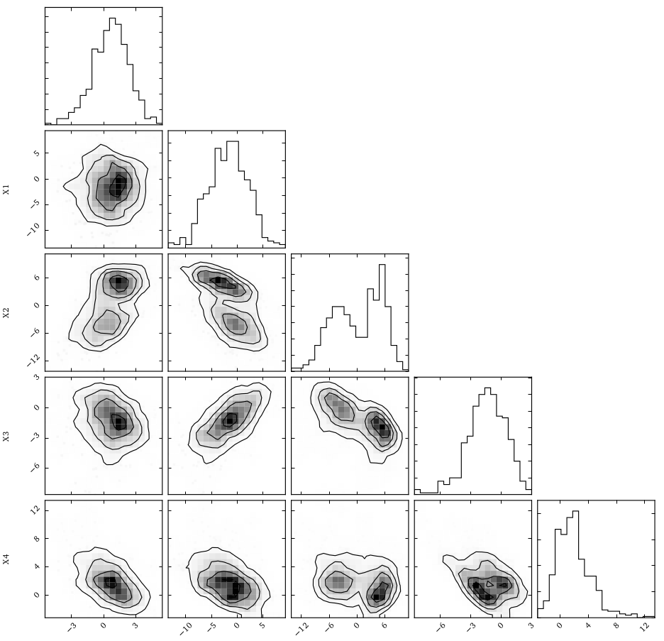]
.kol-2-3.width-100[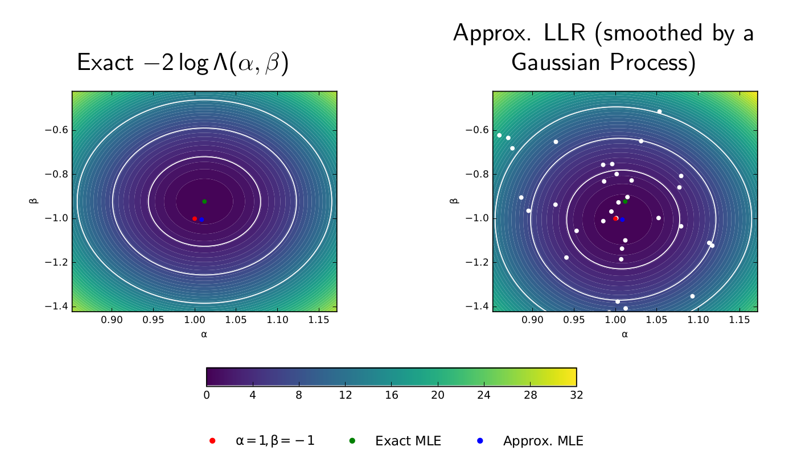
]
]
$$-2 \log \Lambda(\alpha,\beta) = -2 \log \frac{p(\mathbf{d}|\alpha,\beta)}{p(\mathbf{d}|\hat{\alpha},\hat{\beta})}$$

---

# Diagnostics

.center.width-100[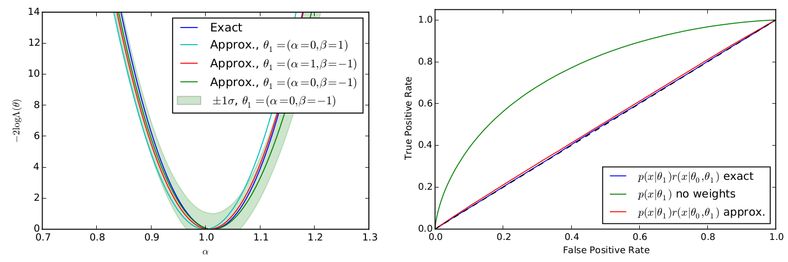]

We need procedures to assess the quality of the approximated ratio $\hat{r}$:
- For inference, the value of the MLE $\hat{\theta}$ should be independent of the value of $\theta\_\text{ref}$ used in the denominator of the ratio.
- Train a classifier to distinguish between unweighted samples from $p(x|\theta\_0)$ and samples from $p(x|\theta\_1)$ weighted by $\hat{r}(x|\theta\_0, \theta\_1)$.

---

class: middle

# Mining gold from simulators

.footnote[
Refs: Brehmer et al, 2018 ([arXiv:1805.12244](https://arxiv.org/pdf/1805.12244.pdf))
]

---

class: center

  
.width-70[]

$p(x|\theta)$ is usually intractable.

What about $p(x,z|\theta)$?

---

  
.center.width-70[]

$$
\begin{aligned}
p(x,z|\theta) &= p(z\_1|\theta)p(z\_2|z\_1,\theta) \ldots p(z\_T|z\_{<T},\theta)p(x|z\_{\leq T},\theta) \\\\
&= p(z\_1|\theta)p(z\_2|\theta) \ldots p(z\_T|\theta) p(x|z\_T) \\\\
&= p(x|z\_T) \prod\_{t} \theta^{z\_t} (1-\theta)^{1-z\_t}
\end{aligned}
$$

.center[This can be computed as the ball falls down the board!]

---

class: middle

.center.width-50[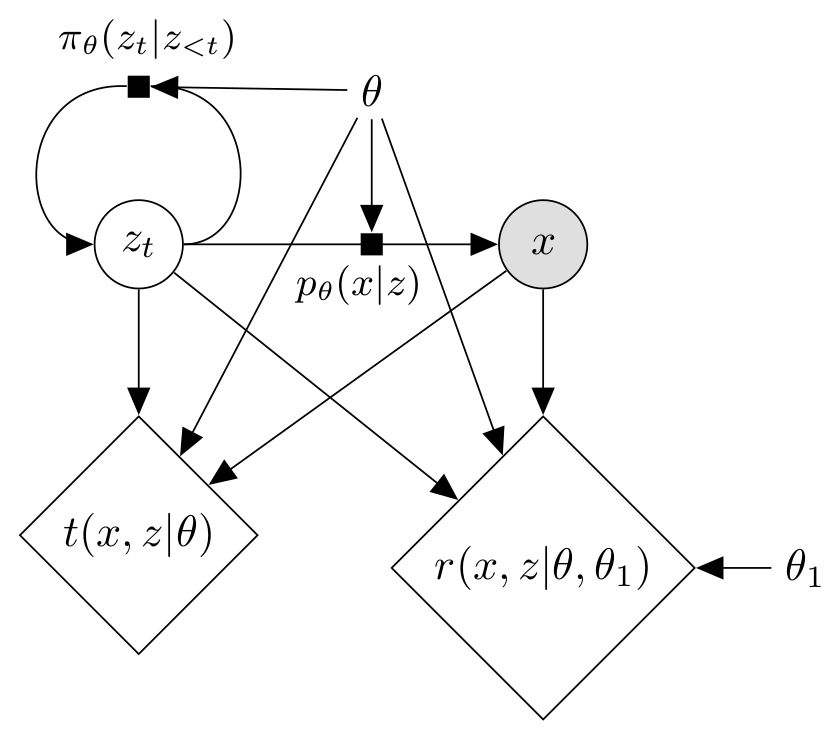]

The simulator can be viewed as a graphical model that abstracts the simulation as a probabilistic sequence of latent states $z\_t$.
- The simulator implements a probabilistic transition $\pi\_\theta(z\_t|z\_{<t})$.
- The simulator emits an observation $x$ based on $p(x|z,\theta)$.

---

# Mining gold

As the trajectory $z\_1, ..., z\_T$ and the observable $x$ are emitted, it is often possible:
- to calculate the *joint likelihood* $p(x,z|\theta)$ as $\pi\_\theta(z\_1)\pi\_\theta(z\_2|z\_1) \ldots \pi\_\theta(z\_T|z\_{<T})p(x|z,\theta)$;
- to calculate the *joint likelihood ratio* $r(x,z|\theta\_0, \theta\_1)$;
- to calculate the *joint score* $t(x,z|\theta\_0) = \nabla\_\theta \log p(x,z|\theta) \big|\_{\theta\_0}$.

We call this process **mining gold** from your simulator!

---

class: middle

.center.width-40[]

Observe that the joint likelihood ratios
$$r(x,z|\theta\_0, \theta\_1) \equiv \frac{p(x,z|\theta\_0)}{p(x,z|\theta\_1)}$$
are scattered around $r(x|\theta\_0,\theta\_1)$.

Can we use them to approximate $r(x|\theta\_0,\theta\_1)$?

---

class: middle

Consider the squared error of a function $\hat{g}(x)$ that only depends on $x$, but is trying to approximate a function $g(x,z)$ that also depends on the latent $z$:
$$L\_{MSE} = \mathbb{E}\_{p(x,z|\theta)} \left[ (g(x,z) - \hat{g}(x))^2 \right].$$

Via calculus of variations, we find that the function $g^\*(x)$ that extremizes $L\_{MSE}[g]$ is given by
$$\begin{aligned}
g^\*(x) &= \frac{1}{p(x|\theta)} \int p(x,z|\theta) g(x,z) dz \\\\
&= \mathbb{E}\_{p(z|x,\theta)} \left[ g(x,z) \right]
\end{aligned}$$

---

class: middle

Therefore, by identifying the $g(x,z)$ with the joint likelihood ratio $r(x,z|\theta\_0, \theta\_1)$ and $\theta$ with $\theta\_1$, we define
$$L\_r = \mathbb{E}\_{p(x,z|\theta\_1)} \left[ (r(x,z|\theta\_0, \theta\_1) - \hat{r}(x))^2 \right], $$
which is minimized by
$$
\begin{aligned}
r^\*(x) &= \frac{1}{p(x|\theta\_1)} \int p(x,z|\theta\_1) \frac{p(x,z|\theta\_0)}{p(x,z|\theta\_1)} dz \\\\
&= \frac{p(x|\theta\_0)}{p(x|\theta\_1)} \\\\
&= r(x|\theta\_0,\theta\_1).
\end{aligned}$$

---

class: middle

.center.width-40[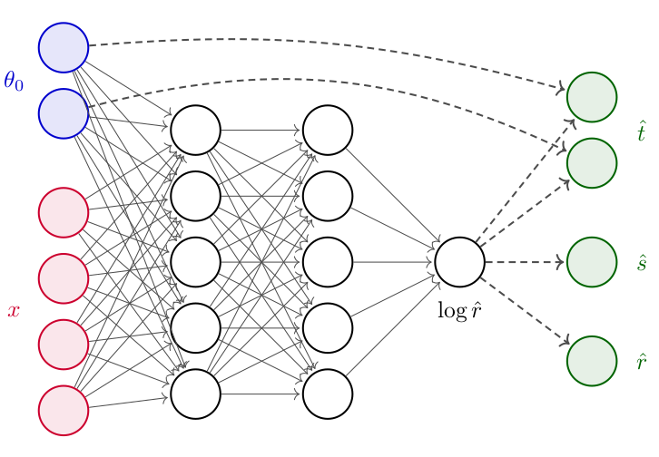]

How does one find $r^\*$?
$$r^\*(x|\theta\_0,\theta\_1) = \arg\min\_{\hat{r}} L\_r[\hat{r}]$$
Minimizing functionals is exactly what *machine learning* does. In our case,
- $\hat{r}$ are neural networks (or the parameters thereof);
- $L\_r$ is the loss function;
- minimization is carried out using stochastic gradient descent from the data extracted from the simulator.

---

class: middle

.center.width-40[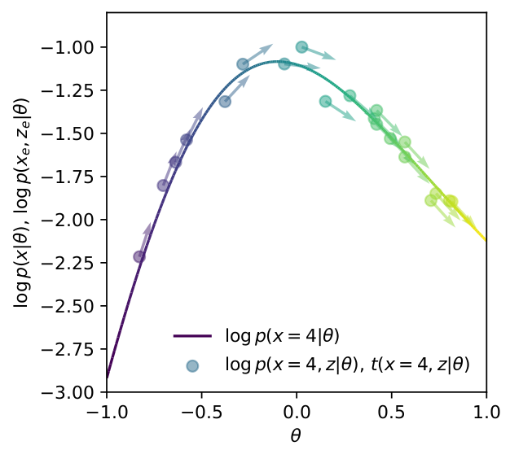]

Similarly, we can mine the simulator to extract the joint score
$$t(x,z|\theta\_0) \equiv \nabla\_\theta \log p(x,z|\theta) \big|\_{\theta\_0},$$
which indicates how much more or less likely $x,z$ would be if one changed $\theta\_0$.

---

class: middle

Using the same trick, by identifying $g(x,z)$ with the joint score $t(x,z|\theta\_0)$ and $\theta$ with $\theta\_0$, we define
$$L\_t = \mathbb{E}\_{p(x,z|\theta\_0)} \left[ (t(x,z|\theta\_0) - \hat{t}(x))^2 \right],$$
which is minimized by
$$\begin{aligned}
t^\*(x) &= \frac{1}{p(x|\theta\_0)} \int p(x,z|\theta\_0) (\nabla\_\theta \log p(x,z|\theta) \big|\_{\theta\_0})  dz \\\\
&= \frac{1}{p(x|\theta\_0)} \int p(x,z|\theta\_0) \frac{\nabla\_\theta p(x,z|\theta) \big|\_{\theta\_0}}{p(x,z|\theta\_0)} dz \\\\
&= \frac{\nabla\_\theta p(x|\theta)\big|\_{\theta\_0}}{p(x|\theta\_0)} \\\\
&= t(x|\theta\_0).
\end{aligned}$$

---

# Rᴀsᴄᴀʟ

 

$$L = L\_r + L\_t$$

 

.center.width-100[]

---

# Family of likelihood-free inference strategies

 

.width-100[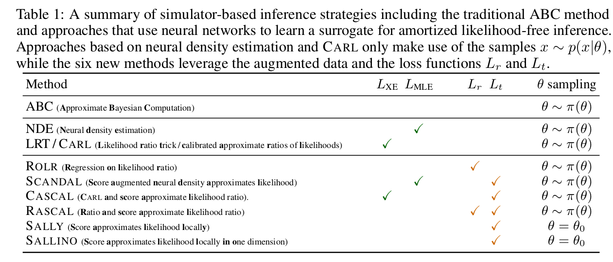]

---

# Effective inference

 

.grid[
.kol-1-2.width-100[]
.kol-1-2.width-100[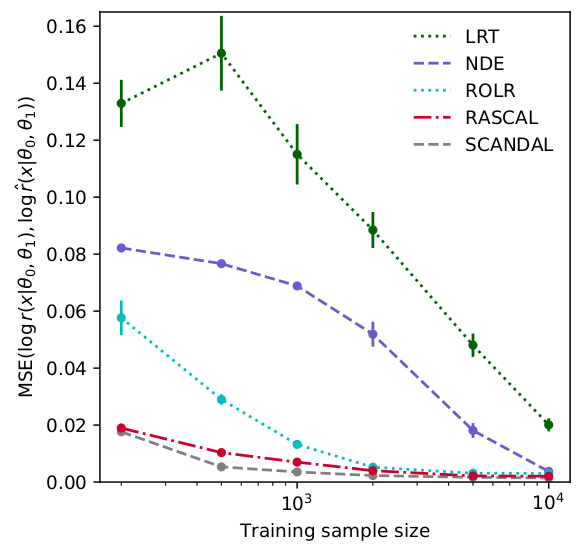]
]

.center[Toy experiment on the Galton board.]

---

class: middle

# Constraining Effective Field Theories, effectively

---

# LHC processes

 

.width-100[]

.footnote[Credits:
Johann Brehmer
]

---

count: false

# LHC processes

 

.width-100[]

.footnote[Credits:
Johann Brehmer
]

---

count: false

# LHC processes

 

.width-100[]

.footnote[Credits:
Johann Brehmer
]

---

count: false

# LHC processes

 

.width-100[]

.footnote[Credits:
Johann Brehmer
]

---

class: middle

$$p(x|\theta) = \underbrace{\iiint}\_{\text{intractable}} p(z\_p|\theta) p(z\_s|z\_p) p(z\_d|z\_s) p(x|z\_d) dz\_p dz\_s dz\_d$$

---

class: middle

Key insights:
- The distribution of parton-level four-momenta
$$p(z\_p|\theta) = \frac{1}{\sigma(\theta)} \frac{d\sigma(\theta)}{dz\_p},$$
where $\sigma(\theta)$ and $\tfrac{d\sigma(\theta)}{dz\_p}$ are the total and differential cross sections, is tractable.
- Downstream processes $p(z\_s|z\_p)$, $p(z\_d|z\_s)$ and $p(x|z\_d)$ do not depend on $\theta$.

This implies that both $r(x,z|\theta\_0,\theta\_1)$ and $t(x,z|\theta\_0)$ can be mined. E.g.,
$$
\begin{aligned}
r(x,z|\theta\_0,\theta\_1) &= \frac{p(z\_p|\theta\_0)}{p(z\_p|\theta\_1)} \frac{p(z\_s|z\_p)}{p(z\_s|z\_p)} \frac{p(z\_d|z\_s)}{p(z\_d|z\_s)} \frac{p(x|z\_d)}{p(x|z\_d)} \\\\
&= \frac{p(z\_p|\theta\_0)}{p(z\_p|\theta\_1)}
\end{aligned}$$

---

# Proof of concept

.center.width-50[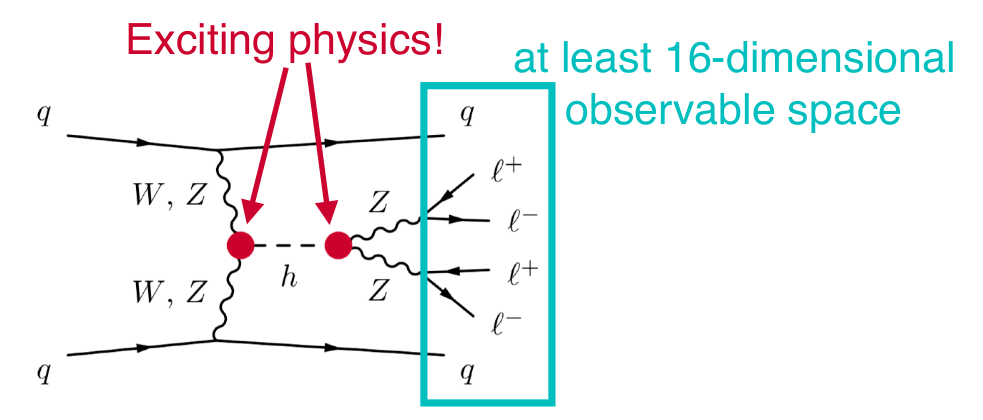]

- Context: Higgs production in weak boson fusion.
- Goal: constraints on two theory parameters.
$$\mathcal{L} = \mathcal{L}\_{SM} + \underbrace{\frac{f\_W}{\Lambda^2}} \; \frac{ig}{2} \, (D^\mu\phi)^\dagger \, \sigma^a \, D^\nu\phi \; W\_{\mu\nu}^a - \underbrace{\frac{f\_{WW}}{\Lambda^2}} \; \frac{g^2}{4} \, (\phi^\dagger\phi) \; W^a_{\mu\nu} \, W^{\mu\nu\, a}$$
- Two setups:
    - Simplified setup in which we can compare to true likelihood.
    - Realistic simulation with approximate detector effects.

.footnote[Credits:
Johann Brehmer
]

---

# Precise likelihood ratio estimates

 
.center.width-100[]

.footnote[Credits:
Johann Brehmer
]

---

# Increased data efficiency

 
.center.width-100[]

.footnote[Credits:
Johann Brehmer
]

---

# Better sensitivity

.center.width-60[]

.footnote[Credits:
Johann Brehmer
]

---

# Stronger bounds

 
.center.width-100[]

.footnote[Credits:
Johann Brehmer
]

---

class: middle

# Summary

---

class: middle

- Machine learning provides several solutions for simulation-based likelihood-free inference.
- Cᴀʀʟ defines an optimal solution for likelihood ratio estimation, which is itself sufficient for inference.
- It is often possible to mine the joint likelihood, the joint likelihood ratio or the joint score.
- These values make it possible to perform likelihood-free inference effectively.

---

# Collaborators

   

.center[
 &nbsp;
 &nbsp;

]

---

# References

- Brehmer, J., Louppe, G., Pavez, J., & Cranmer, K. (2018). Mining gold from implicit models to improve likelihood-free inference. arXiv preprint arXiv:1805.12244.
- Brehmer, J., Cranmer, K., Louppe, G., & Pavez, J. (2018). Constraining Effective Field Theories with Machine Learning. arXiv preprint arXiv:1805.00013.
- Brehmer, J., Cranmer, K., Louppe, G., & Pavez, J. (2018). A Guide to Constraining Effective Field Theories with Machine Learning. arXiv preprint arXiv:1805.00020.
- Cranmer, K., Pavez, J., & Louppe, G. (2015). Approximating likelihood ratios with calibrated discriminative classifiers. arXiv preprint arXiv:1506.02169.

---

class: end-slide, center
count: false

The end.
